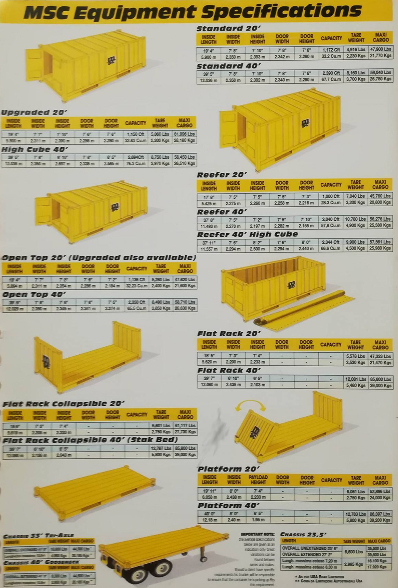

# Conceptos

### Tabla de conceptos

<table style="width:100%">
    <tr>
        <th>Concepto</th>
        <th>Descripción</th>
        <th>Ejemplo</th>
    </tr>
    <tr>
        <td>Containner/Contenedor</td>
        <td>Recipiente de carga para transporte maritimo.</td>
        <td></td>
    </tr>
    <tr>
        <td>CC</td>
        <td>Pago que se realiza en el lugar de embarque por servicio contratado.</td>
        <td></td>
    </tr>
    <tr>
        <td>PP</td>
        <td>Pago que se trealiza en el lugar donde se ha contratado el servicio.</td>
        <td></td>
    </tr>
    <tr>
        <td>Reservación/Booking</td>
        <td>Reservación y/o confirmación de servicio requerido, sirviendo como referencia para apartar un contenedor con la naviera. </td>
        <td>190MC0031326</td>
    </tr>
    <tr>
        <td>Booking/BMG</td>
        <td>Número de reservación que asigna la naviera o aerolinea.</td>
        <td>190MC0031326</td>
    </tr>
    <tr>
        <td>Reservación Transporte Multimodal/BTM</td>
        <td>Número de reservación que asigna el forwarder (TM).</td>
        <td>TMUL095617</td>
    </tr>
    <tr>
        <td>Carga de Factura Maestra/Master BL</td>
        <td>Documento y/o clave que genera la línea aviera.</td>
        <td>MSCUZY684624</td>
    </tr>
    <tr>
        <td>Carga de Factura de Casa/House BL</td>
        <td>Documento y/o clave que genera el Forwarder para el cliente.</td>
        <td>TMUL095617</td>
    </tr>
    <tr>
        <td>Freight Forwarder/FF</td>
        <td>Intermedario entre un cliente final y una línea aviera para un proceso de transporte de carga.</td>
        <td></td>
    </tr>
    <tr>
        <td>Shipper</td>
        <td>Encargado del manejo de la embarción en punto origen.</td>
        <td></td>
    </tr>
    <tr>
        <td>ETA/Estimated Time to Arrive</td>
        <td>Tiempo estimado de arribo.</td>
        <td>2017-10-04</td>
    </tr>
    <tr>
        <td>ETD/Estimated Time to Downloading</td>
        <td>Tiempo estimado de llegada.</td>
        <td>2017-10-21</td>
    </tr>
    <tr>
        <td>POL/Port Of Loading</td>
        <td>Puerto de carga.</td>
        <td>Manzanillo-México</td>
    </tr>
    <tr>
        <td>POD/Port Of Downloading</td>
        <td>Puerto de descarga.</td>
        <td>México</td>
    </tr>
    <tr>
        <td>LCL/Less Containner Load</td>
        <td>Carga que comparte contenedor con otros clientes, también llamada carga suelta.</td>
        <td></td>
    </tr>
    <tr>
        <td>FCL/Full Containner Load</td>
        <td>Carga que ocupa un solo contenedor.</td>
        <td></td>
    </tr>
    <tr>
        <td>BAF</td>
        <td>Factor de ajuste o correción por costo de combustible.</td>
        <td></td>
    </tr>
    <tr>
        <td>FCR</td>
        <td>Es un documento transaccional emitido por un transitario para confirmar la recepción de carga.</td>
        <td></td>
    </tr>
    <tr>
        <td>LOF/Letter of Indemnity</td>
        <td>Permite al destianatario recibir la entrega de sus bienes sin la entrega del conocimiento de embarque original que se ha retrasado o se ha perdido.</td>
        <td></td>
    </tr>
    <tr>
        <td>TEU/Unidad Equivalente (Twenty-Foot)</td>
        <td>Unidad equivalente a veinte pies.</td>
        <td></td>
    </tr>
    <tr>
        <td>THC</td>
        <td>Cargos por manipulación portuaria, tanto en puerto de salida como destino.</td>
        <td></td>
    </tr>
    <tr>
        <td>BF/Booking Fee</td>
        <td>Concepto por emisión del booking.</td>
        <td></td>
    </tr>
    <tr>
        <td>EIR/Equipment Inspection Report</td>
        <td>Documento emitido por los depósitos en donde se manifiestan las condiciones en las que se encuentra el contenedor.</td>
        <td></td>
    </tr>
    <tr>
        <td>THC/Terminal Handling Charge</td>
        <td>Concepto por maniobras portuarias.</td>
        <td></td>
    </tr>
    <tr>
        <td>DF/Document Fee</td>
        <td>Concepto por emisiòn del BL.</td>
        <td></td>
    </tr>
    <tr>
        <td>HF/Handling Fee</td>
        <td>Concepto por manejo de cada embarque.</td>
        <td></td>
    </tr>
    <tr>
        <td>AMS Fee/Advance Manifest Surcharge</td>
        <td>Transmisiòn de datos del embarque al sistema de la aduana.</td>
        <td></td>
    </tr>
    <tr>
        <td>TKF/Trucking Fee</td>
        <td>Concepto de arrastre terrestre.</td>
        <td></td>
    </tr>
    <tr>
        <td>CDF/Customs Declation Fee</td>
        <td>Despacho Aduanal.</td>
        <td></td>
    </tr>
    <tr>
        <td>TLX Fee/Telex Release</td>
        <td>Liberación electrónica en contra copia de BL.</td>
        <td></td>
    </tr>
    <tr>
        <td>VGM/Verified Gross Mass</td>
        <td>Declaración del peso bruto de los contenedores ante la términal portuaria.</td>
        <td></td>
    </tr>
    <tr>
        <td>PO/Order Purchase</td>
        <td>Número identificador sugerido por el cliente final.</td>
        <td>KRL4332PER</td>
    </tr>
    <tr>
        <td>AWB/Air Waybill</td>
        <td>Carta de porte aereo (guía aerea).</td>
        <td></td>
    </tr>
    <tr>
        <td>FLT/Flight</td>
        <td>Vuelo en el que será enviada la carga.</td>
        <td></td>
    </tr>
    <tr>
        <td>Comod/Comodity</td>
        <td>Tipo de carga que será transportada en avión.</td>
        <td></td>
    </tr>
    <tr>
        <td>LTD/Local Time Departure</td>
        <td>Hora de partida de vuelo.</td>
        <td></td>
    </tr>
    <tr>
        <td>AF/Air Freight</td>
        <td>Flete aereo.</td>
        <td></td>
    </tr>
    <tr>
        <td>FSC/Fuel Surcharge</td>
        <td>Recargo por combustible.</td>
        <td></td>
    </tr>
    <tr>
        <td>SSC/Security Surcharge</td>
        <td>Recargo por seguridad.</td>
        <td></td>
    </tr>
    <tr>
        <td>WM/Weight</td>
        <td>Recargo por combustible.</td>
        <td></td>
    </tr>
</table>

### Tabla de codigos Aeropuertos
<table style="width:100%">
    <tr>
      <th>Codigo</th>
      <th>Aeropuerto</th>
    </tr>
    <tr>
      <td>HKG</td>
      <td>Hong Kong</td>
    </tr>
    <tr>
      <td>PVG</td>
      <td>Shanghài</td>
    </tr>
    <tr>
      <td>LAX</td>
      <td>Los Ángeles</td>
    </tr>
    <tr>
      <td>MDA</td>
      <td>Madrid</td>
    </tr>
</table>

### Tabla de codigos Aerolineas
<table style="width:100%">
    <tr>
      <th>Codigo</th>
      <th>Aeropuerto</th>
    </tr>
    <tr>
      <td>CX</td>
      <td>Cathay Pacific</td>
    </tr>
    <tr>
      <td>AM</td>
      <td>Aeromèxico</td>
    </tr>
    <tr>
      <td>KLM</td>
      <td>KLM Cargo</td>
    </tr>
    <tr>
      <td>UA</td>
      <td>United Airlines</td>
    </tr>
</table>

### Contenedores

### Conocimiento de embarque

### Rutas de embarques

### Tarifas por distancia

