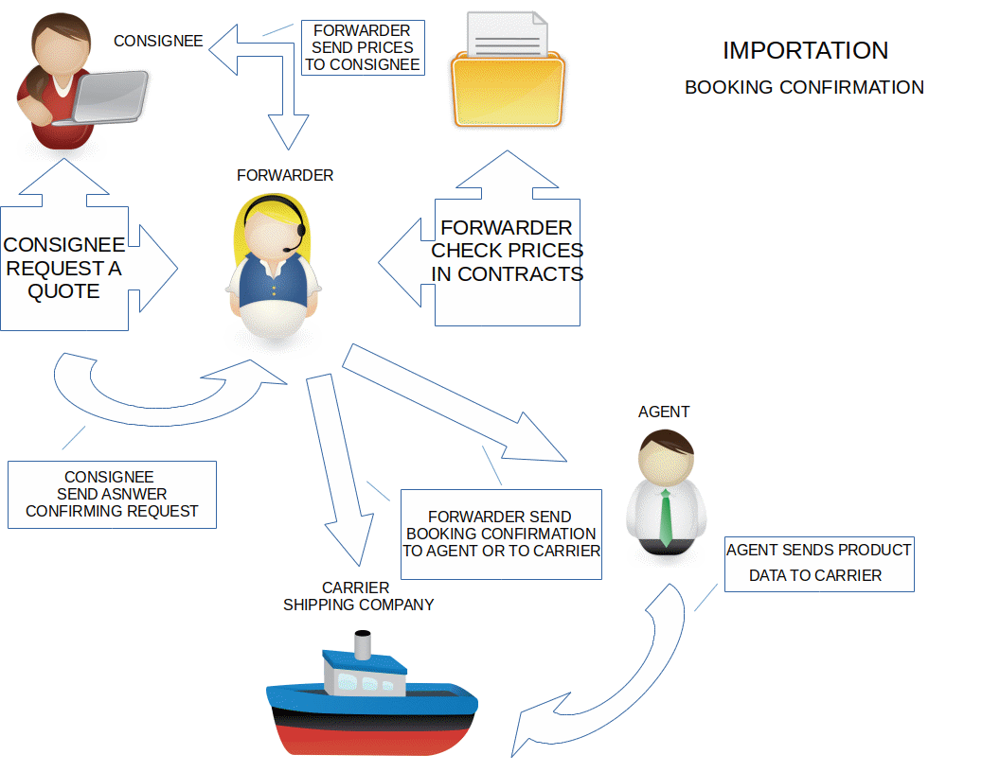
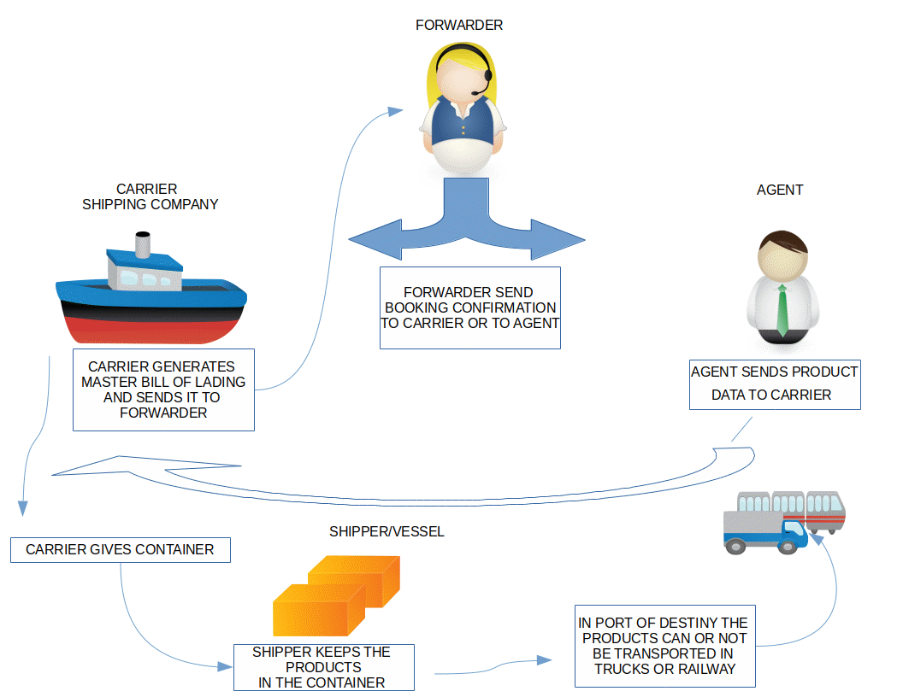
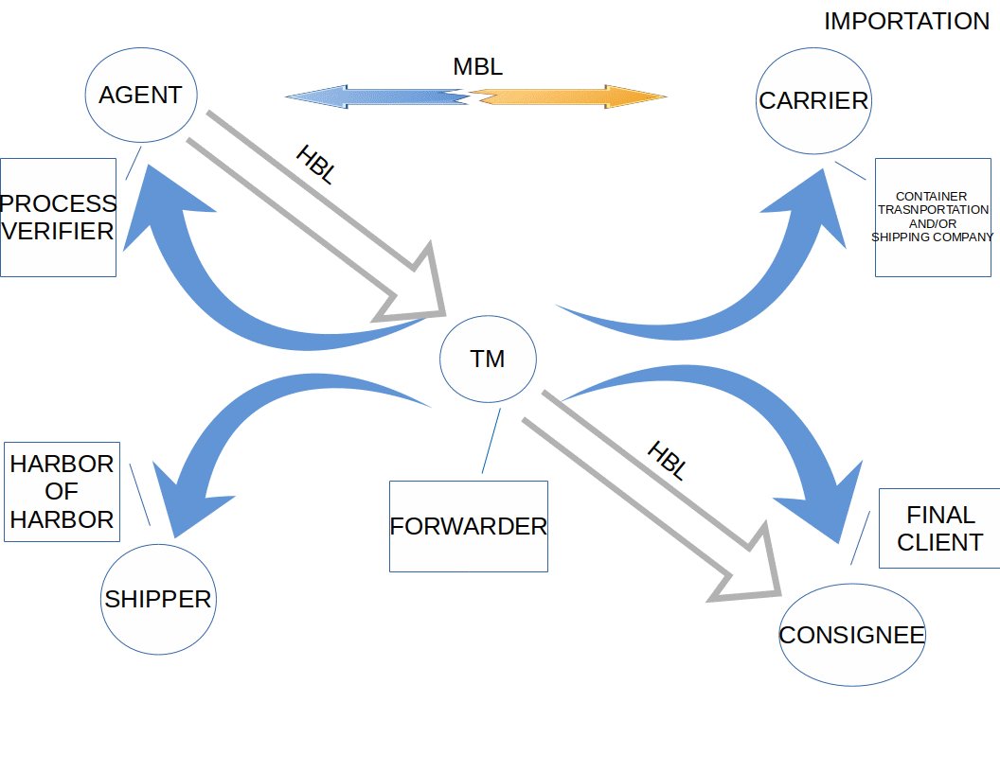

# Importación

## Paso 1.
El consignee genera una petición de importación de mercancía, verifica precios y envía correo de confirmación para tal ser vicio.

## Paso 2.
El forwarder genera un booking o reserva para el cliente que desea importar su mercancía.

## Paso 3.
El booking o reserva es enviada a una naviera o al agente (dependiendo si interviene uno, en el proceso).

## Paso 4.
La naviera genera un Master BL, el cual es un desglose de los productos que serán transportados, destino y origen de estos y precio del servicio. La Master BL funge como factura y/o comprobante de un servicio entre el forwarder y la naviera.

## Paso 5.
La naviera enviá el Master BL al forwarder.

## Paso 6.
El forwarder genera un House BL, el cual, de igual forma que el Master BL, contiene un desglose de productos a enviar, destino y origen de estos y el precio que se generará por el servicio (desglosando cargos extra que genere el servicio), estos precios contienen un aumento por el servicio otorgado.

## Paso 7.
El House BL, es enviado al consignee por medio de correo electrónico durante el proceso de transporte, el cual será actualizado conforme se generen o no, cargos extra de servicio.

## Paso 8.
Al momento de arribo a puerto destino, el consignee tiene que presentar su House BL en copia o en original, esto dependiendo del acuerdo que se haya generado entre el forwarder y el consignee para que su mercancía pueda ser liberada.

## Paso 9.
Los productos pueden o no, ser transportados en camión o en tren a un siguiente destino, esto si el consignee ha solicitado dicho servicio.

## Diagrama de proceso

## Paso 1.

## Paso 2.

## Proceso general.

